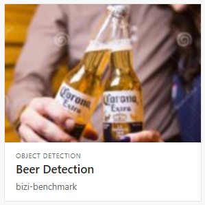
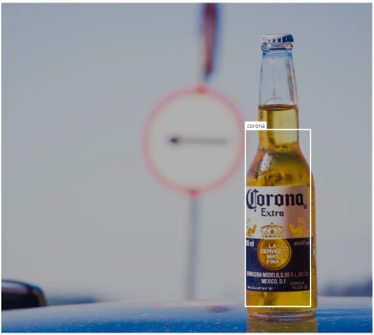
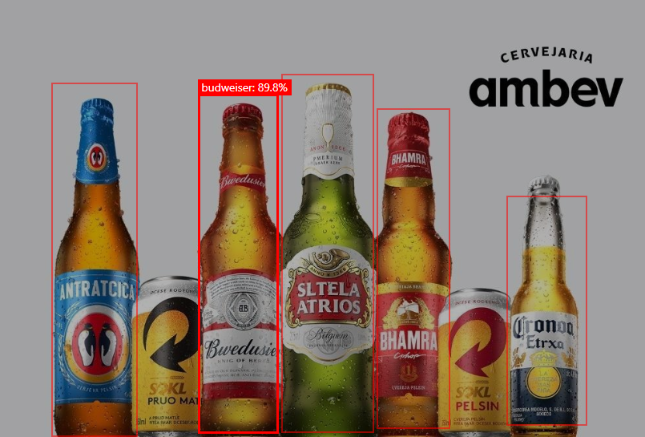

# Azure Custom Vision - Object Detection

Azure Cognitive Services Custom Vision using the JavaScript SDK for Object Detection.



## Setup

Create the Cognitive Services resource:

```
az cognitiveservices account create -n <name> -g <group> --kind CognitiveServices --sku S0 -l eastus --yes
```

You can also use `--sku F0` which is the free tier.

Go to [customvision.ai](https://www.customvision.ai/projects#/settings) resources and copy the folling parameters:


You may also get these values from the Azure Portal. I opened issue [#14595](https://github.com/Azure/azure-cli/issues/14595) to get the Key using the CLI.

Start by copying the sample `.env`:

```
cp .env.sample .env
```

Now add the values to the `.env` file:

```
customVisionTrainingKey=<training_key>
customVisionTrainingEndPoint=<endpoint>
predictionResourceId=<prediction_resource_id>
```

:information_source: _Custom Vision recommends at least 50 images per set to ensure model performance. 
Following the rule of thumb 70/30 you should have at least 15 additional images for the prediction tests._

Set the `project name` and `publish name` in the `.env` file:

```
projectName=<your_project_name>
publishName=<publish_name>
```

Add your samples path to the `.env` file:

```
trainingSampleDataRoot=<path>
predictionSampleDataRoot=<path>
```

Add the tags to the `.env` file separeted by commas (`,`):

```
tags=tag1,tag2,tag3
```

## Training and Prediction

If you haven't already, download the dependencies:

```sh
npm install
```

First you need to create your project and tags:

```sh
$ ts-node src/createProject.ts

Project created. Add the ID to the .env file: xxxxxxxx-xxxx-xxxx-xxxx-xxxxxxxxxxxx
```

Add the project ID to the `.env` file:

```
projectId=xxxxxxxx-xxxx-xxxx-xxxx-xxxxxxxxxxxx
```

Upload your images:

_My algorithm is limited to send a single batch of 64 images. Help me with a pull request :grin:_
```sh
ts-node src/upload.ts
```

Go to the [Custom Vision Portal](https://customvision.ai) and tag the images. You may add multiple tags for the same image.

You need to have at least 15 items for each tag for object detection.



Train your model:

```sh
ts-node src/training.ts
```

Run the prediction tests:

```sh
ts-node src/prediction.ts
```

This will also publish the iteration. You must unpublish previous iterations on the Performance tab at [customvision.ai](https://www.customvision.ai) if you wish to publish new ones.

You'll get an output for each image:

```
Results:
         budweiser: 1.23% 0.00067794323,0.0699334145,0.038740702,0.9300566
         budweiser: 96.32% 0.182365745,0.24337104,0.104204118,0.756619
         budweiser: 7.03% 0.2837638,0.269703448,0.09547615,0.718327045
         budweiser: 89.82% 0.358226,0.267752945,0.0972617,0.724578857
         budweiser: 96.16% 0.45870012,0.224418223,0.111133575,0.7673404
         budweiser: 94.66% 0.572847,0.299463362,0.08857638,0.6836401
         budweiser: 2.72% 0.637388051,0.405668736,0.130907238,0.464525819
         budweiser: 47.84% 0.728372,0.4846303,0.09750664,0.4907381
         budweiser: 2.77% 0.27285856,0.62536025,0.108680427,0.330352247
         budweiser: 2.41% 0.6389212,0.652789831,0.104773819,0.2945472
         budweiser: 6.49% 0.153952986,0,0.193375885,0.9743123
         budweiser: 2.16% 0.419736058,0,0.207257,0.963360548
         budweiser: 1.18% 0.643069267,0.09114501,0.2224654,0.905299067
         budweiser: 4.31% 0.226873457,0.275986224,0.226002991,0.7033454
         corona: 2.04% 0.5713419,0.3917932,0.0912797451,0.5812621
         corona: 10.40% 0.728372,0.4846303,0.09750664,0.4907381
         corona: 1.93% 0.6389212,0.652789831,0.104773819,0.2945472
         heineken: 1.53% 0.45870012,0.224418223,0.111133575,0.7673404
         heineken: 3.57% 0.5713419,0.3917932,0.0912797451,0.5812621
         heineken: 3.46% 0.728372,0.4846303,0.09750664,0.4907381
```

You may go to the portal now and see the results:



## References

[Custom Vision with SDK](https://docs.microsoft.com/en-us/azure/cognitive-services/custom-vision-service/quickstarts/object-detection?pivots=programming-language-javascript)

[Custom Vision Service Limits and Quotas](https://docs.microsoft.com/en-us/azure/cognitive-services/custom-vision-service/limits-and-quotas)
